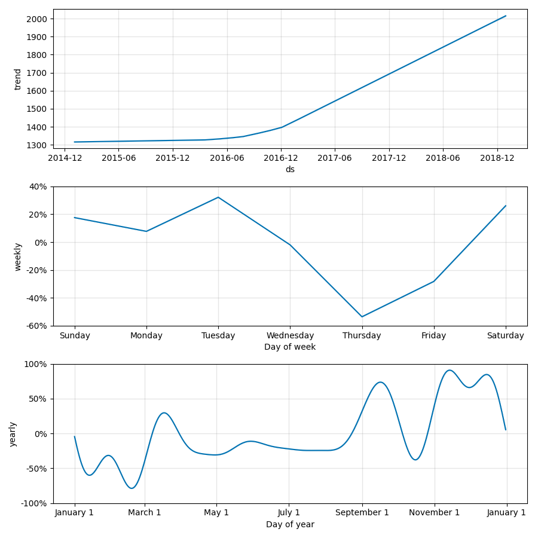
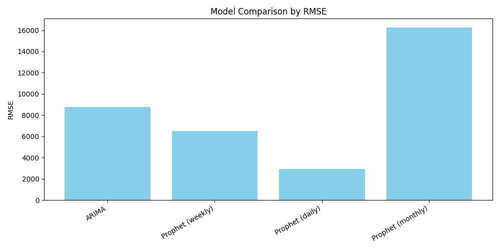
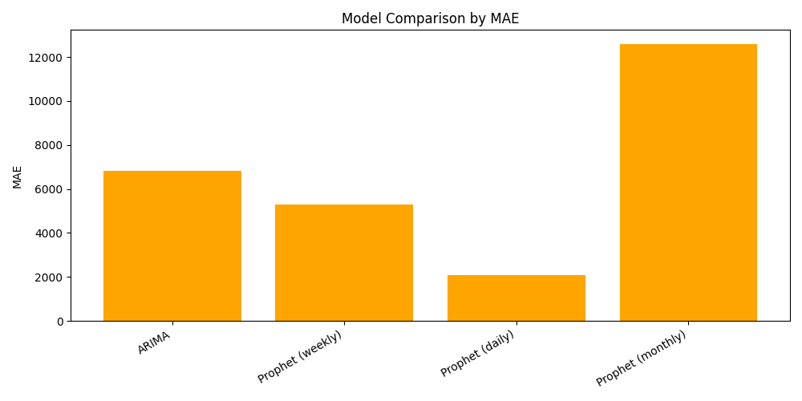

# 🛒 Retail Sales Forecasting using Time Series Models  

## 📌 Project Overview  
Retail businesses depend heavily on accurate sales forecasts for:  
- 📦 **Inventory planning** (reduce stockouts & overstock)  
- 🚚 **Logistics & staffing** (better scheduling)  
- 📈 **Business strategy** (anticipating seasonal peaks)  

In this project, I built a **Retail Sales Forecasting system** using **time series models (ARIMA & Prophet)**.  
The goal: predict future sales at **daily, weekly, and monthly levels** and identify which model works best for retail.  

---

## 🗂️ Workflow  

1. **Data Preprocessing**  
   - Cleaned raw dataset (9,800 records).  
   - Converted dates, handled missing values.  
   - Aggregated into **daily, weekly, monthly sales**.  

2. **Exploratory Data Analysis (EDA)**  
   - Identified **trends** (2015–2018 growth).  
   - Observed **seasonality** (year-end peaks).  
   - Used ADF, ACF, PACF to check stationarity & autocorrelation.  

3. **Modeling**  
   - **ARIMA (Auto-Regressive Integrated Moving Average)** — baseline statistical model.  
   - **Prophet (Meta/Facebook)** — advanced model for trend + seasonality + holidays.  

4. **Evaluation**  
   - Metrics: **RMSE (Root Mean Squared Error)** & **MAE (Mean Absolute Error)**.  
   - Compared models across granularities.  

5. **Final Forecast**  
   - Retrained best model on **full dataset**.  
   - Generated **future forecasts** (next 90 days daily, next 26 weeks weekly).  

---

## 📊 Results  

| Granularity | Model             | RMSE   | MAE   | Notes |
|-------------|-------------------|--------|-------|-------|
| Weekly      | ARIMA (1,2,3)     | 8767   | 6815  | Baseline, weaker |
| Weekly      | Prophet (weekly)  | 6502   | 5287  | Balanced, smoother |
| Daily       | Prophet (daily)   | **2904** | **2095** | ✅ Best accuracy |
| Monthly     | Prophet (monthly) | 16280  | 12598 | Too coarse, loses signals |

---

## 🔎 Key Insights  
- **Prophet outperforms ARIMA** in retail forecasting.  
- **Daily Prophet** = best accuracy → captures weekday patterns + holiday peaks.  
- **Weekly Prophet** = practical balance → stable for inventory/logistics planning.  
- **Monthly Prophet** = poor accuracy → use only for long-term trend visualization.  
- Adding **holidays (Diwali, Christmas, Black Friday)** can improve performance further.  

---

## 📈 Key Visualizations  

### 1. Daily Sales Forecast (Prophet)  
  

### 2. Prophet Components (Trend + Seasonality)  
  

### 3. Model Comparison (RMSE)  
  

### 4. Model Comparison (MAE)  
  

---

## 🛠️ Tech Stack  
- **Python** (Pandas, NumPy, Matplotlib, Seaborn)  
- **Statsmodels** → ARIMA  
- **Prophet (Meta/Facebook)** → trend + seasonality forecasting  
- **Jupyter Notebook** → experimentation & analysis  

---

## 📂 Project Structure  
```
retail-sales-forecasting/
│── data/
│   ├── raw/            # original dataset
│   ├── processed/      # cleaned daily/weekly/monthly data
│
│── notebooks/
│   ├── 01-data-inspection.ipynb
│   ├── 02-preprocessing.ipynb
│   ├── 03-eda.ipynb
│   ├── 04-arima.ipynb
│   ├── 05-prophet.ipynb
│   ├── 06-model-comparison.ipynb
│   └── 07-final-forecast.ipynb
│
│── outputs/
│   ├── forecasts/      # saved forecast CSVs
│   ├── figures/        # plots & charts
│   └── metrics/        # RMSE/MAE tables
│
│── requirements.txt    # dependencies
│── README.md           # project overview (this file)
```

---

## 🚀 How to Run  

1. Clone this repo:  
   ```bash
   git clone https://github.com/swastiksingh04/retail-sales-forecasting.git
   cd retail-sales-forecasting
   ```  

2. Create environment & install dependencies:  
   ```bash
   pip install -r requirements.txt
   ```  

3. Open Jupyter Notebook:  
   ```bash
   jupyter notebook
   ```  

4. Run notebooks in order:  
   `01-data-inspection` → `02-preprocessing` → `03-eda` → `04-arima` → `05-prophet` → `06-model-comparison` → `07-final-forecast`  

---

## 📌 Conclusion  
- Prophet consistently outperformed ARIMA for retail sales forecasting.  
- **Prophet (daily)** is the best choice for short-term forecasts.  
- **Prophet (weekly)** is best for practical business planning.  
- **Prophet (monthly)** not suitable for forecasting.   
